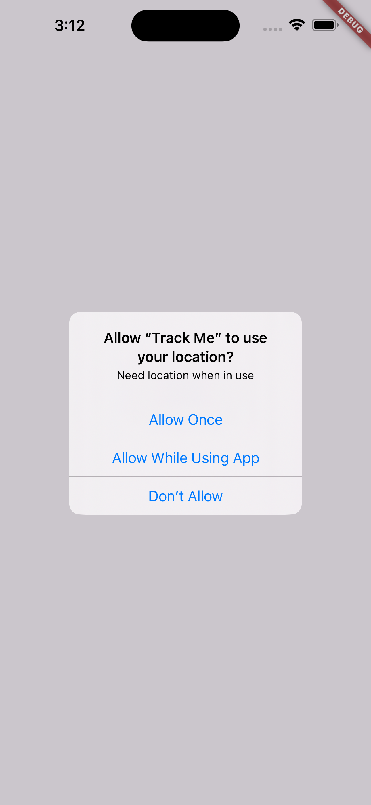
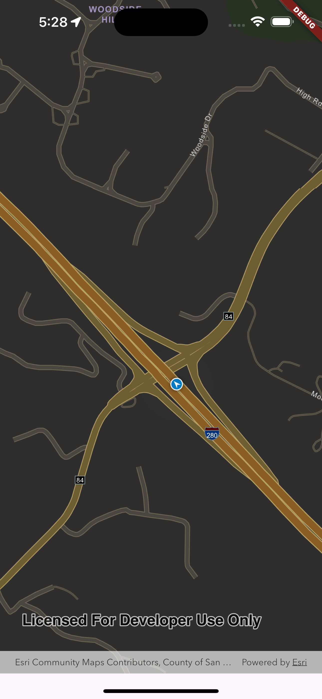

# Comprehensive guide to managing location permissions in ArcGIS Maps SDK for Flutter

The **ArcGIS Maps SDK** provides a built-in location data source that delivers location updates from your device. When utilizing this data source, your application will automatically prompt the user with a system location permissions dialog if permission has not yet been granted.

However, you may want to have more control over how and when location requests are made within your app.

In this article, we will guide you through the process of implementing location permissions in your Flutter app using the **ArcGIS Maps SDK** alongside the **permission_handler** package.

## **Installation and Setup**

First, add the necessary dependencies to your `pubspec.yaml` file:
dependencies:

```dart
arcgis_maps_flutter: ^latest_version
permission_handler: ^latest_version
```

## **Configure Platform-Specific Settings**

**Android Configuration**

Add the following permissions to `android/app/src/main/AndroidManifest.xml` file:

```dart
<uses-permission android:name="android.permission.ACCESS_FINE_LOCATION" />
<uses-permission android:name="android.permission.ACCESS_COARSE_LOCATION" />
```

Update your `android/app/build.gradle` file:

```dart
android {
	compileSdkVersion 33
	...
}
```

Modify your `android/gradle.properties` file:

```dart
android.useAndroidX=true
android.enableJetifier=true
```

**iOS Configuration**

Add the following to your `ios/Runner/Info.plist` file:

```dart
<!-- Permission options for the `location` group -->
<key>NSLocationWhenInUseUsageDescription</key>
<string>Need location when in use</string>
<key>NSLocationAlwaysAndWhenInUseUsageDescription</key>
<string>Always and when in use!</string>
<key>NSLocationUsageDescription</key>
<string>Older devices need location.</string>
<key>NSLocationAlwaysUsageDescription</key>
```

## **Variable initialization**

In this section, we will define key variables that are essential for managing the map view and location data in our application.

```dart
// Create a controller for the map view.
final _mapViewController = ArcGISMapView.createController();

// Create the system location data source.
final _locationDataSource = SystemLocationDataSource();

// A flag indicating whether the map view is ready for interaction.
var _ready = false;

// Variable to track the status of location permissions.
var _locationPermission = AppPermissionStatus.denied;

// Variable to hold the current application lifecycle state.
AppLifecycleState? _appLifecycleState;
```

## **Managing Permission Requests and Changes**

The **permission_handler** package allows us to manage various app permissions, however in our context, we will focus specifically on the following permissions:

```jsx
enum AppPermissions {
  granted,
  denied,
  permanentlyDenied,
}
```

### Location permissions initialization

we will define the `initLocationPermissions` method to check the initial status of location permissions.

This method will help us determine whether the user has already `granted`, `denied`, or `permanently denied` location access before we proceed with any location-related functionality in our application.

```dart
Future<void> initLocationPermissions() async {
  final status = await Permission.location.status;
  switch (status) {
    case PermissionStatus.granted:
      setState(() {
        _locationPermission = AppPermissionStatus.granted;
      });
    case PermissionStatus.permanentlyDenied:
      setState(() {
        _locationPermission = AppPermissionStatus.permanentlyDenied;
      });
    case PermissionStatus.denied:
    default:
      setState(() {
        _locationPermission = AppPermissionStatus.denied;
      });
    }
}
```

To ensure that our application properly checks for location permissions, we will call the `initLocationPermissions` method within the `initState` override. This allows us to perform the permission check as soon as the widget is initialized. This will show a popup similar to the one displayed below:



To make our UI responsive to changes in the application's lifecycle state, we will also add `WidgetsBinding.instance.addObserver(this)`.

Additionally, we will implement a check to ensure that we only initialize the location permissions when they have not yet been granted.

```dart
@override
void initState() {
	WidgetsBinding.instance.addObserver(this);
  if (_locationPermission != AppPermissionStatus.granted) {
    initLocationPermissions();
  }
  super.initState();
}
```

### Monitor app’s lifecycle

To handle permission checks, we'll monitor the app's lifecycle states. The Flutter app lifecycle consists of four states. We'll update the app lifecycle every time it changes.

When the state is `resumed` and the permission isn't granted, we'll request it again. To achieve this, we need to override the `didChangeAppLifecycleState` method. This method is called whenever the application's lifecycle state changes.

```dart
@override
void didChangeAppLifecycleState(AppLifecycleState state) {
  super.didChangeAppLifecycleState(state);
  setState(() {
    _appLifecycleState = state;
  });
  if (_appLifecycleState == AppLifecycleState.resumed) {
    if (_locationPermission != AppPermissionStatus.granted) {
      initLocationPermissions();
    }
  }
}
```

We will now implement the `checkLocationPermissions` method. This method will request location permissions from the user and handle the response accordingly.

```dart
Future<void> checkLocationPermissions() async {
    final requestPermission = await Permission.location.request();
    if (requestPermission.isGranted) {
      setState(() {
        _locationPermission = AppPermissionStatus.granted;
      });
    } else if (requestPermission.isPermanentlyDenied) {
      setState(() {
        _locationPermission = AppPermissionStatus.permanentlyDenied;
      });
    } else {
      setState(() {
        _locationPermission = AppPermissionStatus.denied;
      });
    }
}
```

### Cleaning Up the Widget Lifecycle

To cleanup and maintain the widget lifecycle, it’s essential to call the `dispose()` method. This method will remove the current object as an observer from the widget binding and stop the location updates when they are no longer needed.

```dart
@override
void dispose() {
    WidgetsBinding.instance.removeObserver(this);
    _locationDataSource.stop(); // Stop location updates
    super.dispose(); // Call the superclass dispose method
}
```

### Allowing Users to Open App Settings for Location Permissions

When requesting location permissions multiple times, if the user does not accept the request and the permission is marked as permanently denied, the user will see a screen similar to the one shown below.


In this scenario, we will provide the user with the option to open the app settings to accept the location permission. This can be achieved by calling the `openAppSettings` method when the user clicks a designated button.

Since we are actively listening to the app's lifecycle, the permission status will automatically update based on whether the user grants or denies the location permission in the settings.

## Starting the Location Data Source

To initiate the location data source, we will define a function called `_onMapViewReady`. This function will be triggered when the `ArcGISMapView` is fully initialized and ready for interaction. Inside this function, we will start the location data source to begin receiving location updates.

```dart
void _onMapViewReady() async {
  // Create a map with the Navigation Night basemap style.
  _mapViewController.arcGISMap =
      ArcGISMap.withBasemapStyle(BasemapStyle.arcGISNavigationNight);

  // Set the initial system location data source and auto-pan mode.
  _mapViewController.locationDisplay.dataSource = _locationDataSource;
  _mapViewController.locationDisplay.autoPanMode =
      LocationDisplayAutoPanMode.recenter;
  // Attempt to start the location data source (this will prompt the user for permission).
  try {
    await _locationDataSource.start();
  } on ArcGISException catch (e) {
    if (mounted) {
      showDialog(
        context: context,
        builder: (_) => AlertDialog(content: Text(e.message)),
      );
    }
  }

  // Set the ready state variable to true to enable the UI.
  setState(() => _ready = true);
}
```

## Integrating with ArcGISMapView

Make sure to connect this function to the `ArcGISMapView` initialization. You can do this by passing the `_onMapViewReady` function as a callback when setting up the map view.

```dart
ArcGISMapView(
	controllerProvider: () => _mapViewController,
  onMapViewReady: _onMapViewReady,
),
```

**Once location access is granted and the app functions correctly, we will see a screen similar to the last screen :**




### Full code example

```dart
//
// Copyright 2024 Esri
//
// Licensed under the Apache License, Version 2.0 (the "License");
// you may not use this file except in compliance with the License.
// You may obtain a copy of the License at
//
//   https://www.apache.org/licenses/LICENSE-2.0
//
// Unless required by applicable law or agreed to in writing, software
// distributed under the License is distributed on an "AS IS" BASIS,
// WITHOUT WARRANTIES OR CONDITIONS OF ANY KIND, either express or implied.
// See the License for the specific language governing permissions and
// limitations under the License.
//

import 'dart:async';

import 'package:arcgis_maps/arcgis_maps.dart';
import 'package:flutter/material.dart';
import 'package:permission_handler/permission_handler.dart';

class ShowDeviceLocation extends StatefulWidget {
  const ShowDeviceLocation({super.key});

  @override
  State<ShowDeviceLocation> createState() => _ShowDeviceLocationState();
}

class _ShowDeviceLocationState extends State<ShowDeviceLocation>
    with WidgetsBindingObserver {
  // Create a controller for the map view.
  final _mapViewController = ArcGISMapView.createController();
  // Create the system location data source.
  final _locationDataSource = SystemLocationDataSource();
  // A flag for when the map view is ready and controls can be used.
  var _ready = false;
  var _locationPermission = AppPermissionStatus.denied;
  AppLifecycleState? _appLifecycleState;

  @override
  void initState() {
    WidgetsBinding.instance.addObserver(this);
    if (_locationPermission != AppPermissionStatus.granted) {
      initLocationPermissions();
    }
    super.initState();
  }

  @override
  void dispose() {
    WidgetsBinding.instance.removeObserver(this);
    _locationDataSource.stop();
    super.dispose();
  }

  @override
  void didChangeAppLifecycleState(AppLifecycleState state) {
    super.didChangeAppLifecycleState(state);
    setState(() {
      _appLifecycleState = state;
    });
    if (_appLifecycleState == AppLifecycleState.resumed) {
      if (_locationPermission != AppPermissionStatus.granted) {
        initLocationPermissions();
      }
    }
  }

  @override
  Widget build(BuildContext context) {
    return Scaffold(
      body: SafeArea(
          top: false,
          child: Builder(
            builder: (_) {
              switch (_locationPermission) {
                case AppPermissionStatus.denied:
                  return Center(
                    child: ElevatedButton(
                      onPressed: checkLocationPermissions,
                      child: const Text('Enable location'),
                    ),
                  );
                case AppPermissionStatus.permanentlyDenied:
                  return const Center(
                    child: Column(
                      crossAxisAlignment: CrossAxisAlignment.center,
                      mainAxisAlignment: MainAxisAlignment.center,
                      children: [
                        Text(
                          'App location permission is denied. Go to settings and enable the location to use the app',
                          textAlign: TextAlign.center,
                        ),
                        SizedBox(
                          height: 15,
                        ),
                        ElevatedButton(
                          onPressed: openAppSettings,
                          child: Text('Open App settings'),
                        ),
                      ],
                    ),
                  );
                case AppPermissionStatus.granted:
                  return Stack(
                    children: [
                      ArcGISMapView(
                        controllerProvider: () => _mapViewController,
                        onMapViewReady: _onMapViewReady,
                      ),
                      // Display a progress indicator and prevent interaction until state is ready.
                      Visibility(
                        visible: !_ready,
                        child: SizedBox.expand(
                          child: Container(
                            color: Colors.white30,
                            child: const Center(
                              child: CircularProgressIndicator(),
                            ),
                          ),
                        ),
                      ),
                    ],
                  );
              }
            },
          )),
    );
  }

  void _onMapViewReady() async {
    // Create a map with the Navigation Night basemap style.
    _mapViewController.arcGISMap =
        ArcGISMap.withBasemapStyle(BasemapStyle.arcGISNavigationNight);

    // Set the initial system location data source and auto-pan mode.
    _mapViewController.locationDisplay.dataSource = _locationDataSource;
    _mapViewController.locationDisplay.autoPanMode =
        LocationDisplayAutoPanMode.recenter;
    // Attempt to start the location data source (this will prompt the user for permission).
    try {
      await _locationDataSource.start();
    } on ArcGISException catch (e) {
      if (mounted) {
        showDialog(
          context: context,
          builder: (_) => AlertDialog(content: Text(e.message)),
        );
      }
    }

    // Set the ready state variable to true to enable the UI.
    setState(() => _ready = true);
  }

  Future<void> checkLocationPermissions() async {
    final requestPermission = await Permission.location.request();
    if (requestPermission.isGranted) {
      setState(() {
        _locationPermission = AppPermissionStatus.granted;
      });
    } else if (requestPermission.isPermanentlyDenied) {
      setState(() {
        _locationPermission = AppPermissionStatus.permanentlyDenied;
      });
    } else {
      setState(() {
        _locationPermission = AppPermissionStatus.denied;
      });
    }
  }

  Future<void> initLocationPermissions() async {
    final status = await Permission.location.status;
    switch (status) {
      case PermissionStatus.granted:
        setState(() {
          _locationPermission = AppPermissionStatus.granted;
        });
      case PermissionStatus.permanentlyDenied:
        setState(() {
          _locationPermission = AppPermissionStatus.permanentlyDenied;
        });
      case PermissionStatus.denied:
      default:
        setState(() {
          _locationPermission = AppPermissionStatus.denied;
        });
    }
  }
}

enum AppPermissionStatus { granted, denied, permanentlyDenied }
```